# End-to-End CI/CD Pipeline with Jenkins, Argo CD, Kubernetes & Observability Stack

## Project Overview

This project demonstrates a complete CI/CD and monitoring ecosystem for a Spring Boot application, integrating:

* Continuous Integration using Jenkins
* Static code analysis with SonarQube
* Artifact management with Nexus
* Containerization with Docker
* Continuous Deployment using Argo CD
* Kubernetes orchestration (Minikube)
* Observability using Prometheus, Grafana, and Alertmanager
* External webhook exposure using Ngrok

The system is fully automated starting from GitHub push until application deployment on Kubernetes, with monitoring and alerting on both infrastructure and CI pipelines.

---

##  High Level Architecture

Workflow summary:

1. Developer pushes code to GitHub.
2. GitHub triggers Jenkins via Webhook (exposed using Ngrok).
3. Jenkins executes CI pipeline:

   * Checkout code
   * Build & test using Maven
   * SonarQube scan
   * Publish artifact to Nexus
   * Build Docker image
   * Push image to Docker Hub
4. Kubernetes manifests are updated in GitHub.
5. Argo CD detects Git changes and syncs automatically.
6. Application is deployed into Kubernetes namespace.
7. Prometheus scrapes:

   * Kubernetes metrics
   * Jenkins metrics
   * Argo CD metrics
8. Grafana visualizes dashboards.
9. Alertmanager handles alert routing (email).

---

##  Core Components

### CI Layer

* Jenkins
* Maven
* SonarQube
* Nexus Repository
* Docker

### CD Layer

* Kubernetes (Minikube)
* Argo CD

### Observability

* Prometheus Operator (kube-prometheus-stack)
* Grafana
* Alertmanager
* Node Exporter

### External Integration

* GitHub Webhooks
* Ngrok
* Helm 

---

##  Prerequisites / Environment

* CentOS VM
* Docker
* Minikube
* kubectl
* Helm
* Jenkins
* SonarQube (Docker)
* Nexus (Docker)
* Docker Hub account
* GitHub account
* Ngrok
* Google App Password (for Alertmanager email)

---

## 🔄 CI/CD Workflow

### Continuous Integration (Jenkins)

Jenkins is responsible for:

* Pulling source code from GitHub
* Running Maven build
* Executing SonarQube scan
* Publishing artifacts to Nexus
* Building Docker image
* Pushing image to Docker Hub

Pipeline is triggered automatically using GitHub webhook.

Ngrok is used to expose Jenkins externally.

---

### Continuous Deployment (Argo CD)

Argo CD watches Kubernetes manifests stored in GitHub.

Whenever Jenkins updates the manifests (image tag):

* Argo CD detects Git change
* Syncs desired state
* Deploys new version automatically

Application is deployed into a dedicated namespace.

---

## Monitoring & Observability

Prometheus is installed inside Kubernetes using kube-prometheus-stack.

It scrapes:

* Kubernetes cluster
* Nodes
* Pods
* Jenkins metrics (/prometheus endpoint)
* Argo CD metrics

Grafana is used to visualize:

* Cluster CPU / Memory
* Pods
* Jenkins job status
* Jenkins failures
* Queue size
* Build durations

Alertmanager is configured to send email notifications on:

* Jenkins job failure
* Critical cluster conditions

---

##  Jenkins Metrics Integration

Jenkins exposes metrics via:

```
/prometheus
```

Prometheus consumes Jenkins metrics using:

* Custom ConfigMap (jenkins-scrape)
* additionalScrapeConfigs in Prometheus spec

---

## Custom Files Created (Not from GitHub templates)

These files were manually created/configured:

### Kubernetes

* jenkins-scrape ConfigMap
* Argo CD Application manifest
* Spring Boot Deployment YAML
* Spring Boot Service YAML
* Namespace definition

### Prometheus

* Jenkins scrape config
* Jenkins alert rules

### Alertmanager

* alertmanager.yaml (email routing)

### Jenkins

* Jenkinsfile
* Dockerfile edits to reduce image size 

These are not default templates and were customized for this project.

---

##  GitHub Webhook + Ngrok

Since Jenkins runs locally, Ngrok is used to expose port 8080.
##  Screenshots
### GtiHub Webhook

### Jenkins webhook trieger
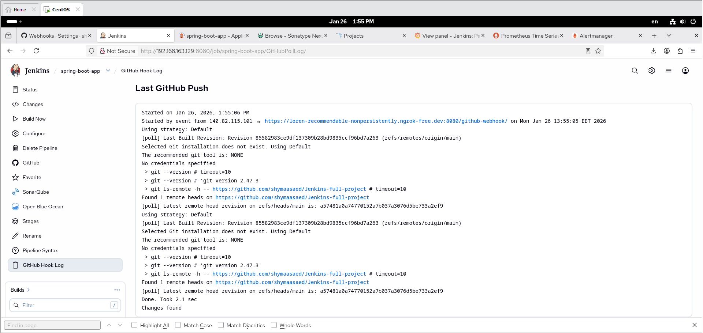 
### Jenkins webhook trieger changes summry
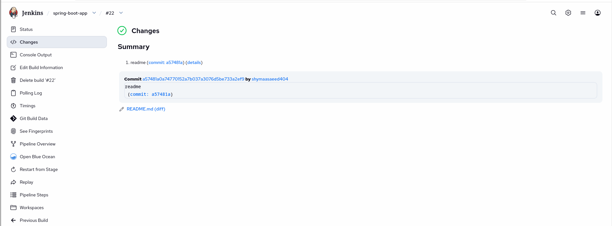 
### Jenkins Pipeline Stages
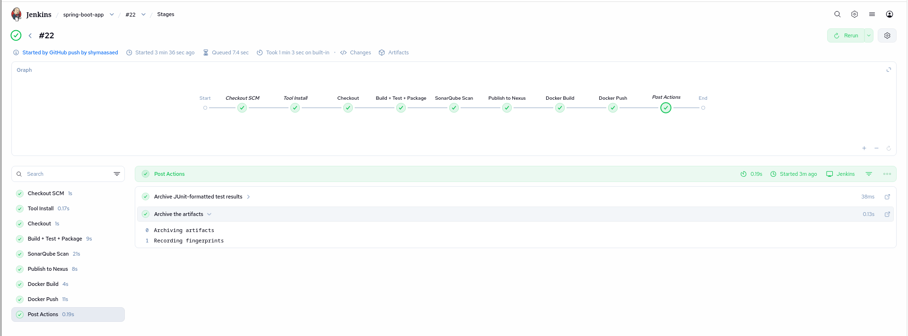
### Nexus artiphacts 
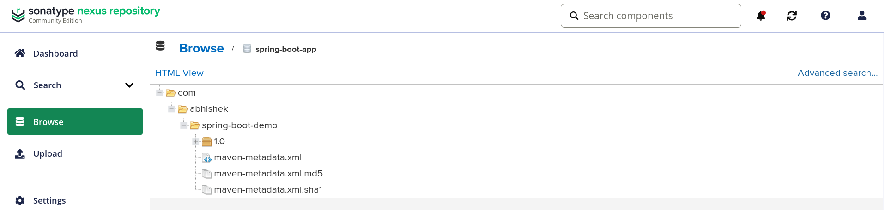
### SonarQube Analysis
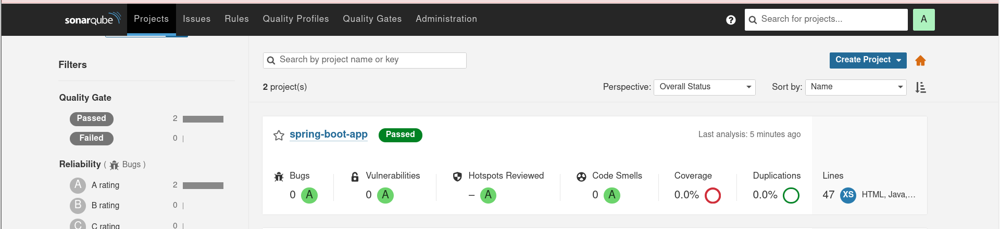
### Docker Hub Image push 
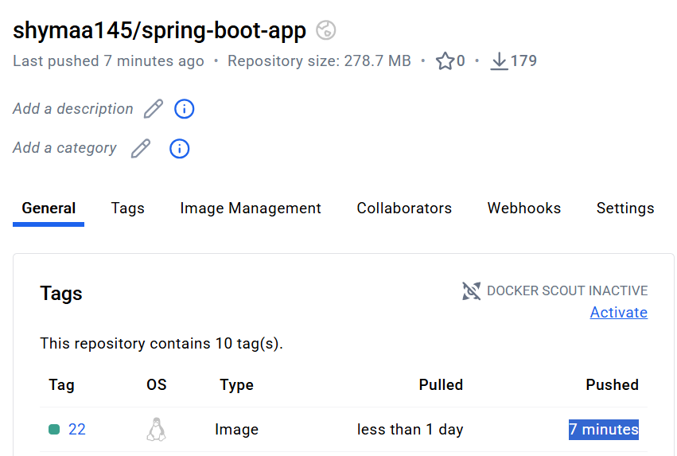
### MUltistaged Docker image 
### Before 
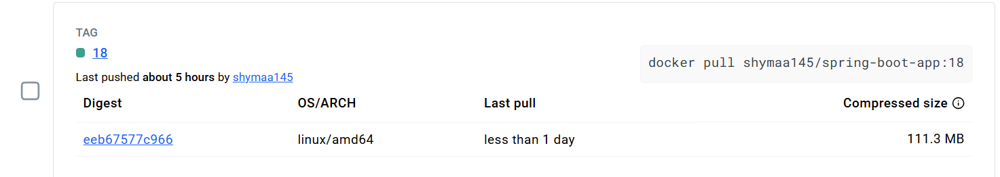
### After 
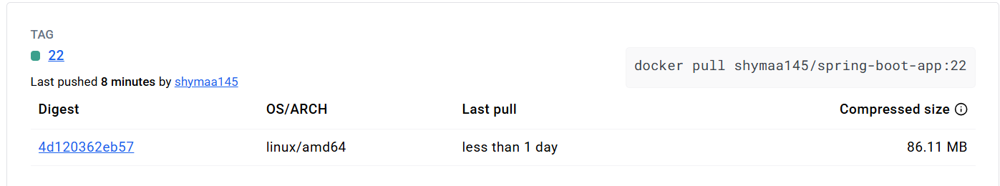

### Minikube & k8s Name spaces
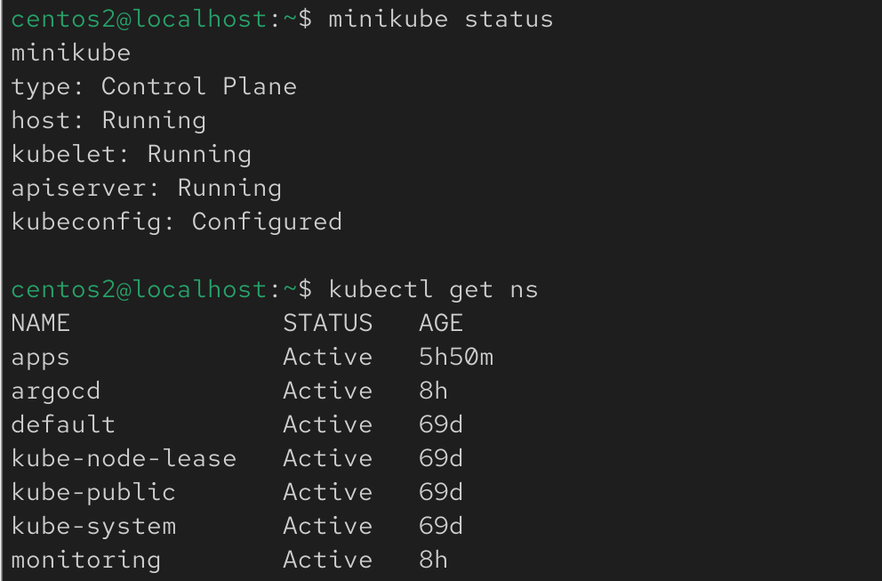
### K8S apps namespce pods & svc created by Argo

### Argo CD Dashboard
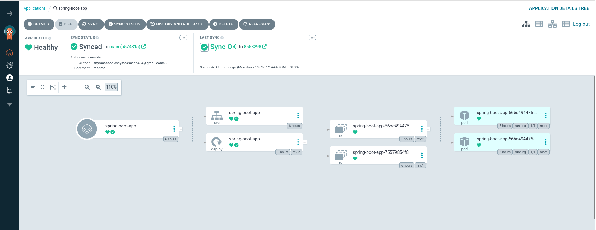
### Argo CD Application Sync 1 replicaset
.png' )
### Argo CD Application Sync 2 replicaset
.png')
### Prometheus & Grafana Monitoring
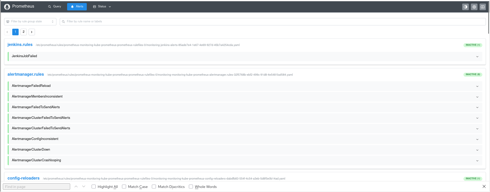
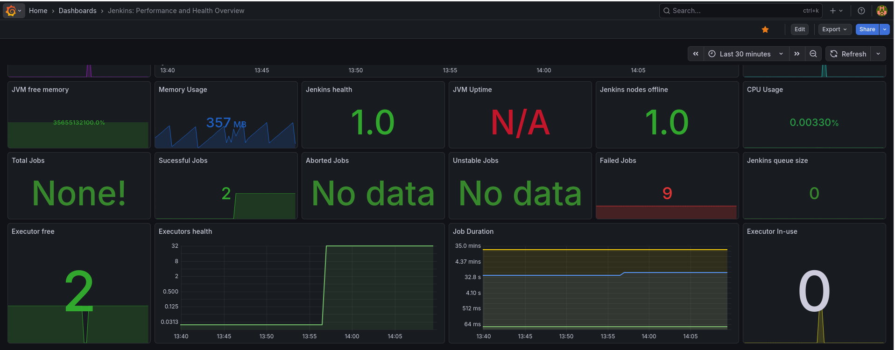
### Alertmanager 
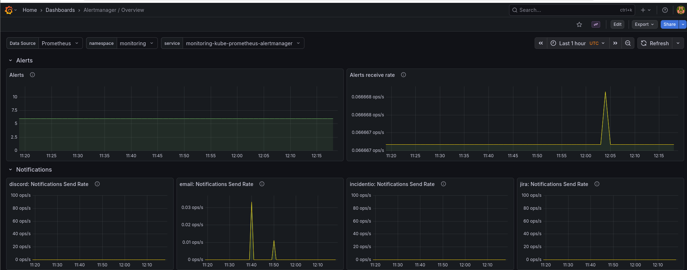
### Alertmanager mail 
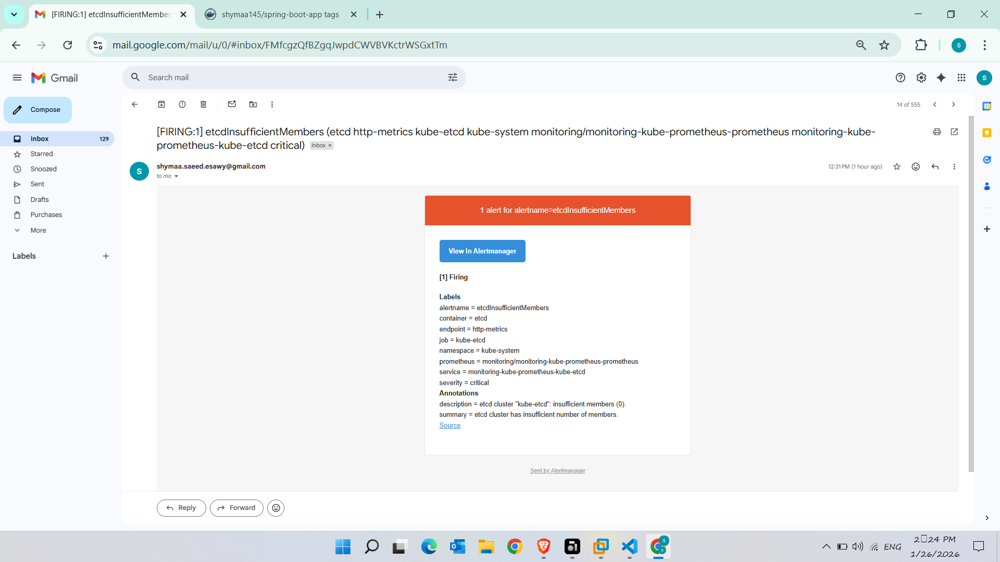
### Grafana mail 
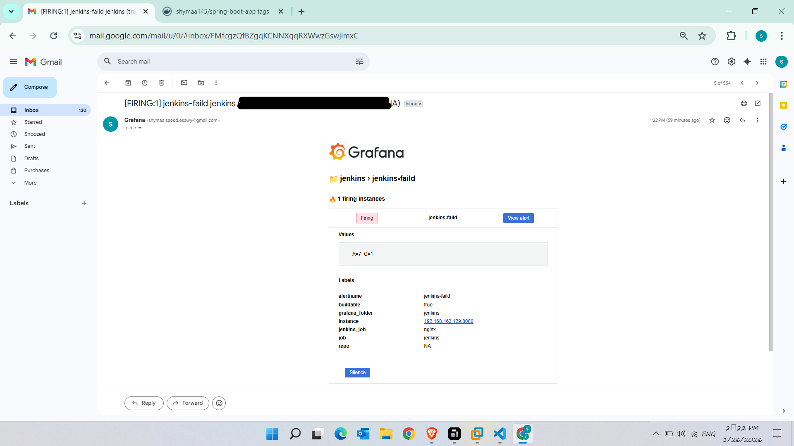
### spring-boot connection 
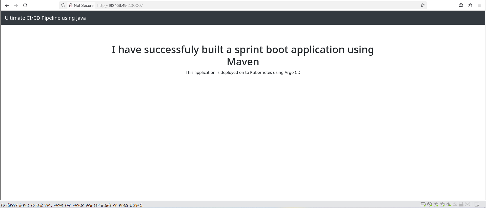

##  Project Goal

The goal is to demonstrate:

* Real CI/CD automation
* GitOps deployment
* Observability integration
* Jenkins + Kubernetes monitoring
* Alert-driven operations


